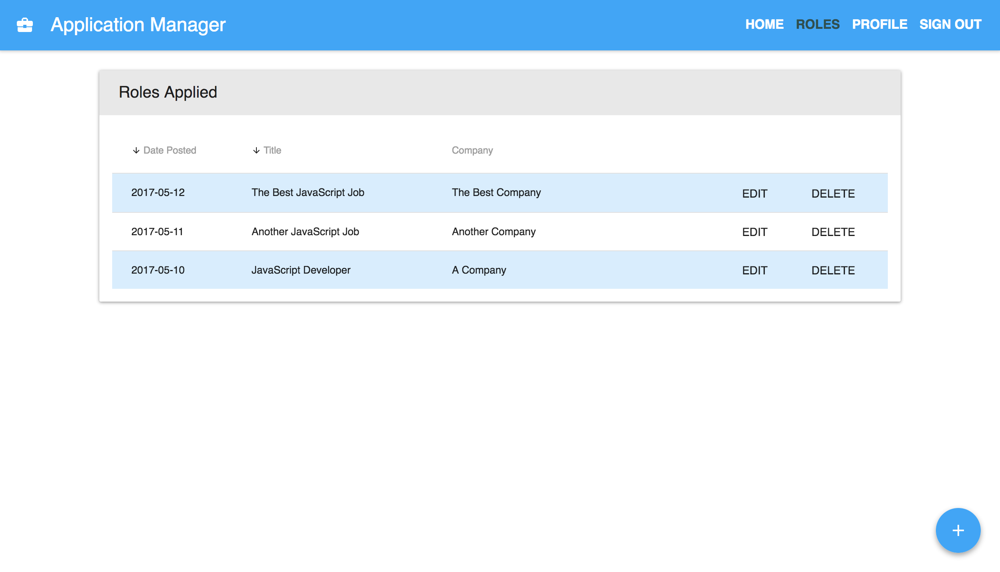

# Application Manager

  

This project was conceived as a full-stack, SPA demonstrating CRUD operations with JavaScript and 
Firebase.  It was built using JavaScript with React, Redux and SCSS for the front end and connecting 
to a Firebase back end.

The application is designed to manage the process of applying for jobs.  The database is secured to a 
particular user with email-based user account creation and sign-in required.  Information about a 
particular position is entered in a tabbed form and saved to the Firebase persistence layer, with this 
data presented in a sortable table.  Functionality has also been added to manage and delete user accounts.

## Technologies Used
- Javascript
- React
- Redux
- Firebase
- Material UI
- SCSS
- Dev tools (Webpack, ESLint, Babel)

## ⚛️ Installation, Testing and Deployment

#### Install
- Clone or download this repository.
- Run `yarn` or `npm i` to install.

#### Development Server
- Run `yarn start` or `npm start` from the root directory.

#### Build
- Run `yarn build` or `npm build` from the root directory.
